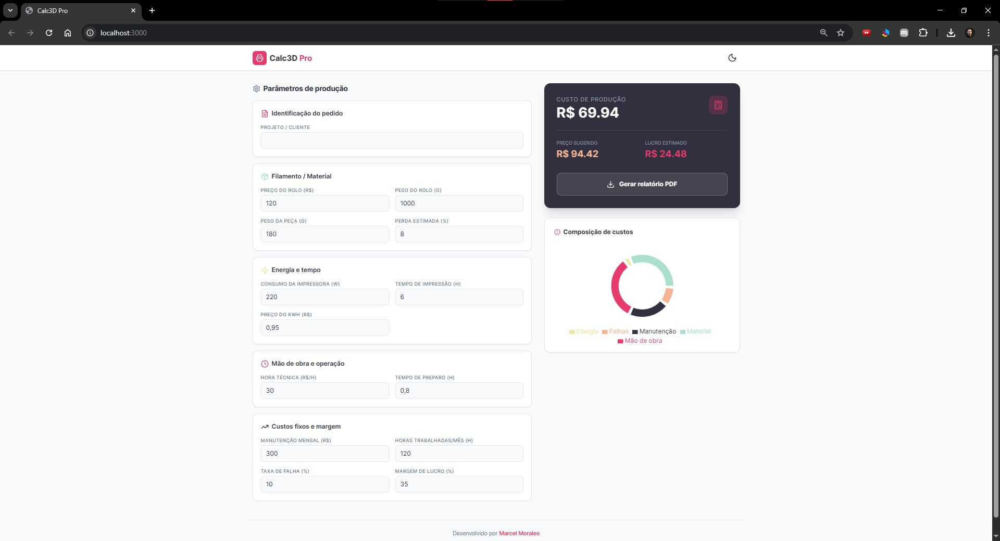
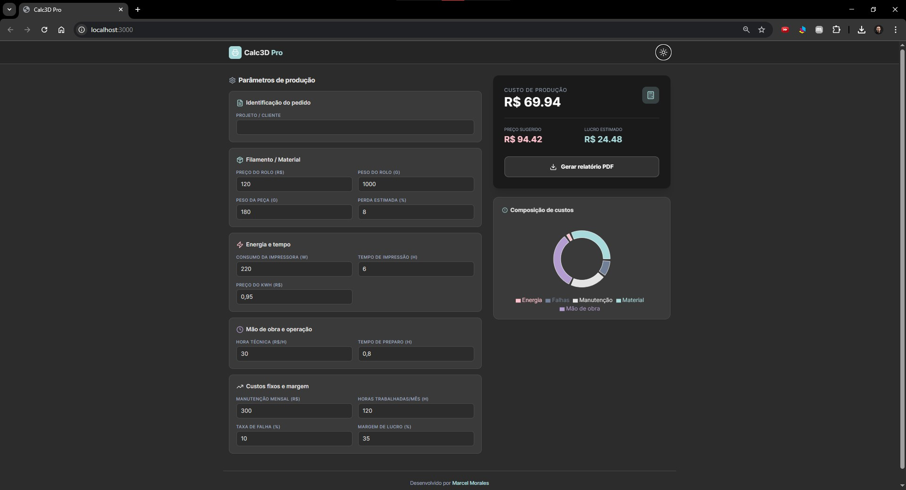
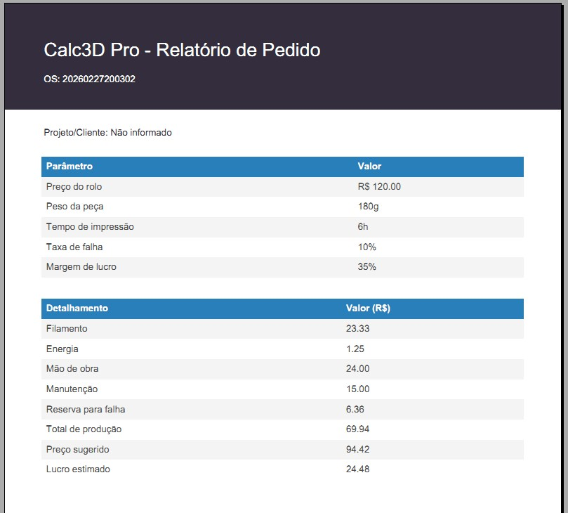

# 🧮 Calc3D Pro

> Calculadora profissional para **orçamento de impressão 3D**, com composição de custos, sugestão de preço de venda e exportação de relatório em PDF.


---

## 📌 Visão geral

O **Calc3D Pro** é uma aplicação web focada em **makers, profissionais de impressão 3D e pequenos negócios** que precisam calcular custos com mais precisão.

Com ele, você consegue:
- calcular custo de material, energia, mão de obra e manutenção;
- adicionar margem de lucro e taxa de falhas;
- visualizar a composição dos custos em gráfico;
- gerar um **PDF profissional** para compartilhar com clientes.

👨‍💻 Desenvolvido por **Marcel Morales**.

---

## 🚀 Instalação e uso

### Pré-requisitos
- **Node.js** 18+
- **npm** 9+

### Passo a passo

```bash
# 1) Clonar o repositório
git clone <URL_DO_REPOSITORIO>

# 2) Entrar na pasta
cd calc3d

# 3) Instalar dependências
npm install

# 4) Rodar ambiente de desenvolvimento
npm run dev

# 5) Gerar build de produção
npm run build

# 6) Rodar preview da build
npm run preview
```

A aplicação será iniciada em ambiente local (normalmente em `http://localhost:3000`).

---

## 🛠️ Tecnologias

<p>
  
  
  
  
  
</p>

- **React + TypeScript** para interface e tipagem estática.
- **Vite** para desenvolvimento rápido e build otimizado.
- **Tailwind CSS** para estilização responsiva.
- **Recharts** para visualização gráfica.
- **jsPDF + jspdf-autotable** para exportação dos relatórios.

---

## 🖼️ Preview

### Tela da aplicação

Light Mode


Dark Mode


Relatório PDF


---

## 🔗 Links úteis

- **Deploy (sugestão):** https://vercel.com/
- **Documentação React:** https://react.dev/
- **Documentação Vite:** https://vite.dev/
- **Documentação Tailwind:** https://tailwindcss.com/docs

---

## 📄 Licença

Este projeto está licenciado sob os termos da **MIT License**.
Consulte o arquivo [`LICENSE`](./LICENSE.md) para mais detalhes.